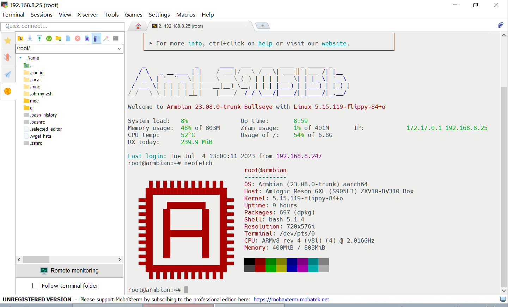

## 前言

1. 中兴ZTE ZXV10-BV310电视盒子，S905L3芯片，1+8G闪存+内存，100M有线，带2个USB2.0、1个TF卡槽，没有板载无线。因为和天邑TY1608的S905L3B芯片系出同门，于是测试刷入之前编译的天邑flippy、5.15、S905L3B的armbian固件，意料之外、情理之中地发现U盘开机后HDMI输出、有线都正常，写入emmc后运作也都没问题。
2. 将结果提交给ophub的O大，O大建议测试S905L3的stable（ophub）内核是否正常，经过flippy/stable、5.15/6.1、S905L3/S905L3B等8种组合测试后，结论是flippy、5.15、S905L3B的组合，也就是一开始误打误撞的组合最正常。因为O大的库默认固件是stable版本，于是有了这个flippy版本云编译仓库。

## 固件编译和下载

1. 本仓库基于armbian官方源码库<a href="https://github.com/armbian/build/">https://github.com/armbian/build/</a>进行编译，特此感谢。
2. 云编译代码修改自<a href="https://github.com/ophub/amlogic-s9xxx-armbian/">https://github.com/ophub/amlogic-s9xxx-armbian/</a>，特此感谢。
3. 测试和适配过程可参考<a href="https://github.com/ophub/amlogic-s9xxx-armbian/issues/1512">这里</a>。

## 刷机流程

1. <a href="https://github.com/ophub/kernel/releases/download/tools/android_tv_mgv2000-s905l2-android4.4.2-root.tar.xz">下载</a>并刷入安卓4.4.2，安卓固件已经root可以远程adb管理。【固件本来给MGV2000用的，可通刷】
2. 用<a href="https://github.com/pbatard/rufus/releases/download/v4.1/rufus-4.1.exe">rufus</a>将本仓库编译好的<a href="https://github.com/w2xg2022/actions4ztebv310/releases/download/Armbian_bullseye_save_2023.07/Armbian_23.08.0_amlogic_s905l3b-ip103h_bullseye_5.15.119_server_2023.07.03.img.gz">armbian固件</a>写入U盘。
3. 【可选】如果不开心设备名称显示问题，可以下载<a href="https://github.com/w2xg2022/actions4ztebv310/raw/main/meson-gxl-s905l3b-m302a.dtb">meson-gxl-s905l3b-m302a.dtb<a/>覆盖U盘BOOT分区中dtb\amlogic的meson-gxl-s905l3b-m302a.dtb。
4. 利用adb reboot update命令让盒子从U盘启动，HDMI会有显示。
5. 进入armbian系统后，运行armbian-install命令以写入emmc，选123（IP103H,TY1608）、1（ext4)。【123这个序号可能会变动，认明IP103H,TY1608】
6. 拔掉U盘重启盒子，即可以emmc运行。

SSH登入armbian画面：

## 固件默认信息

1. 默认IP：DHCP
2. 默认管理员账号：root
3. 默认管理员密码：1234

## 打赏

如果你觉得这个仓库、说明文档和固件等对你有帮助，欢迎通过微信打赏，谢谢。

